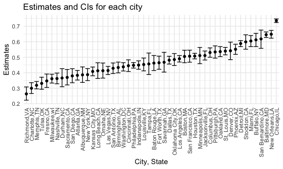
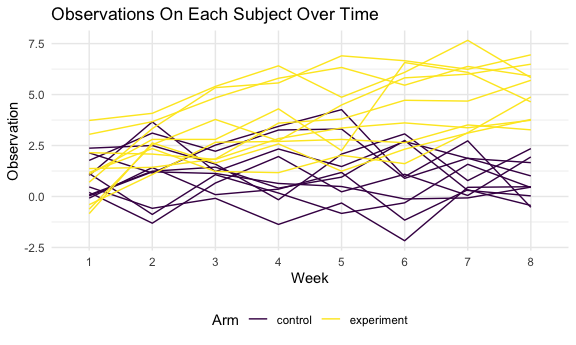

P8105\_HW5\_hx2306
================
HuijunXiao
11/19/2021

### Problem 1

-   Describe the raw data

``` r
homicides <- 
  read.csv("./dataset/homicide-data.csv") %>%
  janitor::clean_names() %>%  
  mutate(city_state = str_c(city,state,sep = ",")) %>%             #create a city_state variable
  mutate(status = case_when(
    disposition %in% 
      c("Closed without arrest","Open/No arrest") ~ "Unsolved",
    disposition == "Closed by arrest" ~ "Solved")) %>%             # categorize unsolved/ solved homicides 
  select(city_state,status) %>%
  subset(city_state != "Tulsa,AL")
```

-   Summarize within cities to obtain the total number of homicides and
    the number of unsolved homicides

``` r
hom_summ <-                                                     #the total number of homicides
  homicides %>%
  group_by(city_state) %>%
  summarise(N_homicides = n())
unsolved_summ <-                                                #the number of unsolved homicides
  homicides %>%
  filter(status == "Unsolved") %>%
  group_by(city_state) %>%
  summarise(N_unsolved_homicides = n())
hom_city <-
  merge(hom_summ,unsolved_summ,by = "city_state",all = TRUE)

hom_city                                                        #city homicides summary table 
```

    ##           city_state N_homicides N_unsolved_homicides
    ## 1     Albuquerque,NM         378                  146
    ## 2         Atlanta,GA         973                  373
    ## 3       Baltimore,MD        2827                 1825
    ## 4     Baton Rouge,LA         424                  196
    ## 5      Birmingham,AL         800                  347
    ## 6          Boston,MA         614                  310
    ## 7         Buffalo,NY         521                  319
    ## 8       Charlotte,NC         687                  206
    ## 9         Chicago,IL        5535                 4073
    ## 10     Cincinnati,OH         694                  309
    ## 11       Columbus,OH        1084                  575
    ## 12         Dallas,TX        1567                  754
    ## 13         Denver,CO         312                  169
    ## 14        Detroit,MI        2519                 1482
    ## 15         Durham,NC         276                  101
    ## 16     Fort Worth,TX         549                  255
    ## 17         Fresno,CA         487                  169
    ## 18        Houston,TX        2942                 1493
    ## 19   Indianapolis,IN        1322                  594
    ## 20   Jacksonville,FL        1168                  597
    ## 21    Kansas City,MO        1190                  486
    ## 22      Las Vegas,NV        1381                  572
    ## 23     Long Beach,CA         378                  156
    ## 24    Los Angeles,CA        2257                 1106
    ## 25     Louisville,KY         576                  261
    ## 26        Memphis,TN        1514                  483
    ## 27          Miami,FL         744                  450
    ## 28      Milwaukee,wI        1115                  403
    ## 29    Minneapolis,MN         366                  187
    ## 30      Nashville,TN         767                  278
    ## 31    New Orleans,LA        1434                  930
    ## 32       New York,NY         627                  243
    ## 33        Oakland,CA         947                  508
    ## 34  Oklahoma City,OK         672                  326
    ## 35          Omaha,NE         409                  169
    ## 36   Philadelphia,PA        3037                 1360
    ## 37        Phoenix,AZ         914                  504
    ## 38     Pittsburgh,PA         631                  337
    ## 39       Richmond,VA         429                  113
    ## 40     Sacramento,CA         376                  139
    ## 41    San Antonio,TX         833                  357
    ## 42 San Bernardino,CA         275                  170
    ## 43      San Diego,CA         461                  175
    ## 44  San Francisco,CA         663                  336
    ## 45       Savannah,GA         246                  115
    ## 46      St. Louis,MO        1677                  905
    ## 47       Stockton,CA         444                  266
    ## 48          Tampa,FL         208                   95
    ## 49          Tulsa,OK         583                  193
    ## 50     Washington,DC        1345                  589

-   Estimate the proportion of homicides that are unsolved

``` r
# prop.test function 
prop.test(
  unsolved_summ %>% 
    filter(city_state == "Baltimore,MD") %>%
    pull(N_unsolved_homicides),
  hom_summ %>%
    filter(city_state == "Baltimore,MD") %>%
    pull(N_homicides)) %>%
  broom::tidy()                                 #pull the estimated proportion and confidence intervals
```

    ## # A tibble: 1 × 8
    ##   estimate statistic  p.value parameter conf.low conf.high method    alternative
    ##      <dbl>     <dbl>    <dbl>     <int>    <dbl>     <dbl> <chr>     <chr>      
    ## 1    0.646      239. 6.46e-54         1    0.628     0.663 1-sample… two.sided

-   Proportion of unsolved homicides and the confidence interval for
    each city

``` r
city_summ <-
  hom_city %>%
  mutate(
    prop = map2(.x = N_unsolved_homicides,                #prop.test
                .y = N_homicides, 
                ~prop.test(x = .x, n = .y)),
    tidy = map(.x = prop,           
               ~broom::tidy(.x))) %>%                     #tidy
  unnest(tidy) %>%                                        #unnest tidy column 
  select(city_state, estimate, conf.low, conf.high)
  
city_summ
```

    ## # A tibble: 50 × 4
    ##    city_state     estimate conf.low conf.high
    ##    <chr>             <dbl>    <dbl>     <dbl>
    ##  1 Albuquerque,NM    0.386    0.337     0.438
    ##  2 Atlanta,GA        0.383    0.353     0.415
    ##  3 Baltimore,MD      0.646    0.628     0.663
    ##  4 Baton Rouge,LA    0.462    0.414     0.511
    ##  5 Birmingham,AL     0.434    0.399     0.469
    ##  6 Boston,MA         0.505    0.465     0.545
    ##  7 Buffalo,NY        0.612    0.569     0.654
    ##  8 Charlotte,NC      0.300    0.266     0.336
    ##  9 Chicago,IL        0.736    0.724     0.747
    ## 10 Cincinnati,OH     0.445    0.408     0.483
    ## # … with 40 more rows

-   City estimates and CIs plot

``` r
city_plot <-
  city_summ %>%
  mutate(city_state = fct_reorder(city_state,estimate)) %>%                 #organize cities 
  ggplot(aes(x = city_state, y = estimate)) +
  geom_point() + 
  geom_errorbar(aes(ymin = conf.low , ymax = conf.high)) +
  theme(axis.text.x = element_text(angle = 90, vjust = 0.6, hjust = 1)) +
  ggtitle("Estimates and CIs for each city") +
  xlab("City, State") +
  ylab("Estimates") 
city_plot
```



### Problem 2

-   Start with a dataframe containing all file names

``` r
P2_data <-
  tibble(file = list.files("./p2data/"),
         path = str_c("./p2data/", file)) 
```

-   Iterate over file names and read in data for each subject

``` r
P2_iterate <-
  P2_data %>%
  mutate(data = map(.x = path, ~read_csv(.x)),
         arm = str_remove(path,".csv"),
         arm = str_remove(arm, "./p2data/")) %>%
  separate(arm, c("arm","id"), sep = "_") %>%
  mutate(arm = 
           ifelse(arm == "con","control","experiment"))%>%
  unnest(data)
```

-   Tidy the result

``` r
P2_tidy <-
  P2_iterate %>% 
  pivot_longer(
    week_1:week_8,
    values_to = "Observation",
    names_to = "Week") %>%
  mutate(Week = str_remove(Week, "week_")) %>%
  select(-path,-file)

P2_tidy
```

    ## # A tibble: 160 × 4
    ##    arm     id    Week  Observation
    ##    <chr>   <chr> <chr>       <dbl>
    ##  1 control 01    1            0.2 
    ##  2 control 01    2           -1.31
    ##  3 control 01    3            0.66
    ##  4 control 01    4            1.96
    ##  5 control 01    5            0.23
    ##  6 control 01    6            1.09
    ##  7 control 01    7            0.05
    ##  8 control 01    8            1.94
    ##  9 control 02    1            1.13
    ## 10 control 02    2           -0.88
    ## # … with 150 more rows

-   Make a spaghetti plot

``` r
spaghetti <-
  P2_tidy %>%
  mutate(arm_new = arm) %>%
  unite("subjects",c(arm,id)) %>%
  ggplot() +
  geom_line(aes(x = Week, y = Observation, group = subjects, color = arm_new)) +
  ggtitle("Observations On Each Subject Over Time") +
  xlab("Week") +
  ylab("Observation") +
  scale_colour_discrete("Arm")
  
spaghetti  
```



From Spaghetti plot, we can tell that observation values of the
experiment group increase from week 1 to week 8, but observation values
of the control group do not change too much across eight weeks. The
overall observation values of the experiment group are higher than those
of the control group.

### Problem 3

``` r
set.seed(10)

iris_with_missing = iris %>% 
  map_df(~replace(.x, sample(1:150, 20), NA)) %>%
  mutate(Species = as.character(Species))

iris_with_missing
```

    ## # A tibble: 150 × 5
    ##    Sepal.Length Sepal.Width Petal.Length Petal.Width Species
    ##           <dbl>       <dbl>        <dbl>       <dbl> <chr>  
    ##  1          5.1         3.5          1.4         0.2 setosa 
    ##  2          4.9         3            1.4         0.2 setosa 
    ##  3          4.7         3.2          1.3         0.2 setosa 
    ##  4          4.6         3.1          1.5        NA   setosa 
    ##  5          5           3.6          1.4         0.2 setosa 
    ##  6          5.4         3.9          1.7         0.4 setosa 
    ##  7         NA           3.4          1.4         0.3 setosa 
    ##  8          5           3.4          1.5         0.2 setosa 
    ##  9          4.4         2.9          1.4         0.2 setosa 
    ## 10          4.9         3.1         NA           0.1 setosa 
    ## # … with 140 more rows

``` r
missing_rep = function(x) {
  if (is.numeric(x)) 
    {filled = replace(x, which(is.na(x)), mean(x, na.rm = TRUE))} 
  else if (is.character(x)) 
    {filled = replace(x, which(is.na(x)), "virginica")}
  filled 
  }

iris_df <-
  map(iris_with_missing, missing_rep) %>%
  bind_rows()

iris_df
```

    ## # A tibble: 150 × 5
    ##    Sepal.Length Sepal.Width Petal.Length Petal.Width Species
    ##           <dbl>       <dbl>        <dbl>       <dbl> <chr>  
    ##  1         5.1          3.5         1.4         0.2  setosa 
    ##  2         4.9          3           1.4         0.2  setosa 
    ##  3         4.7          3.2         1.3         0.2  setosa 
    ##  4         4.6          3.1         1.5         1.19 setosa 
    ##  5         5            3.6         1.4         0.2  setosa 
    ##  6         5.4          3.9         1.7         0.4  setosa 
    ##  7         5.82         3.4         1.4         0.3  setosa 
    ##  8         5            3.4         1.5         0.2  setosa 
    ##  9         4.4          2.9         1.4         0.2  setosa 
    ## 10         4.9          3.1         3.77        0.1  setosa 
    ## # … with 140 more rows
